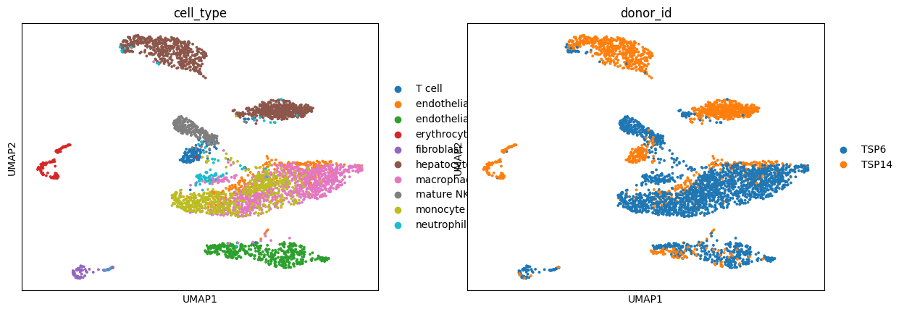
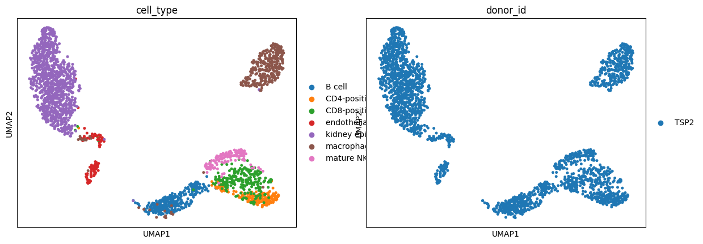

# adict
A package for processing multiple `anndata` objects in parallel

# Documentation

To view the documentation, clone this repository, and then navigate to docs/build/index.html and view in a browser.

# Install
Copy and paste the code below into a terminal window to download this package and install it in a conda env. It assumes conda is already installed.

```bash
git clone https://github.com/ggit12/adict
cd adict
conda create -n adict
conda activate adict
pip install -e .


# About
`adict` is a package that lets you process multiple `anndata` objects in parallel with a simplified interface (so that you can avoid writing a bunch of for loops). This is accomplished by a dictionary-based wrapping of `scanpy`.

The main function in this package is `adata_dict_fapply()` (and its cousin `adata_dict_fapply_return()`, which does the same thing but also returns the result as a dictionary). 

`adata_dict_fapply()` works just like `lapply()` in R. It takes `adata_dict_fapply(adata_dict, func, **kwargs)`. 

- `adata_dict` is a dictionary.
- `func` is a function to apply over each element of the dictionary.
- `**kwargs` are arguments that `func` takes.

You can have `func` take the argument `key` (i.e., `func(adata, key=None)`) if you want the dictionary key to be available within `func`.

Many functions in adict are built around `adata_dict_fapply()`, and the package provides prebuilt wrappers for several common Scanpy functions, as well as functions to build and concatenate `adata` dictionaries.


Read the tutorial below for basic demonstrations.

# Tutorial
This is the tutorial notebook for `adict`. Follow the tutorial below to get started.


```python
#import the package
import adict as adict
```


```python
import warnings
warnings.filterwarnings('ignore')
```


```python
#load an anndata

#for this tutorial, we'll use Tabula Sapiens from cellxgene census
#but you could use any anndata you want
import cellxgene_census

#this command gets liver and kidney from tabula sapiens 
census = cellxgene_census.open_soma(census_version="2023-12-15")
adata = cellxgene_census.get_anndata(
    census,
    organism = "homo_sapiens",
    measurement_name = "RNA",
    obs_value_filter = "(dataset_id == '53d208b0-2cfd-4366-9866-c3c6114081bc') & ((tissue_general == 'liver') | (tissue_general == 'kidney') | (tissue_general == 'spleen'))",
    obs_embeddings = ["uce"]
)


```


```python
adata
```


    AnnData object with n_obs × n_vars = 48652 × 60664
        obs: 'soma_joinid', 'dataset_id', 'assay', 'assay_ontology_term_id', 'cell_type', 'cell_type_ontology_term_id', 'development_stage', 'development_stage_ontology_term_id', 'disease', 'disease_ontology_term_id', 'donor_id', 'is_primary_data', 'self_reported_ethnicity', 'self_reported_ethnicity_ontology_term_id', 'sex', 'sex_ontology_term_id', 'suspension_type', 'tissue', 'tissue_ontology_term_id', 'tissue_general', 'tissue_general_ontology_term_id', 'raw_sum', 'nnz', 'raw_mean_nnz', 'raw_variance_nnz', 'n_measured_vars'
        var: 'soma_joinid', 'feature_id', 'feature_name', 'feature_length', 'nnz', 'n_measured_obs'
        obsm: 'uce'


```python
#adict has a helpful frequency summary function to do frequencies and joint frequencies
adict.display_html_summary(adict.summarize_metadata(adata, columns = ['tissue','cell_type','cell_type*tissue']))
```


<div style="display: flex; flex-wrap: wrap;"><div style="flex: 1; padding: 10px;"><h3>tissue</h3><table border="1"><tr><th></th><th>count</th></tr><tr><td>spleen</td><td>34004</td></tr><tr><td>kidney</td><td>9641</td></tr><tr><td>liver</td><td>5007</td></tr></table></div><div style="flex: 1; padding: 10px;"><h3>cell_type</h3><table border="1"><tr><th></th><th>count</th></tr><tr><td>kidney epithelial cell</td><td>8331</td></tr><tr><td>memory B cell</td><td>6460</td></tr><tr><td>neutrophil</td><td>4622</td></tr><tr><td>classical monocyte</td><td>4443</td></tr><tr><td>CD8-positive, alpha-beta memory T cell</td><td>4301</td></tr><tr><td>plasma cell</td><td>3205</td></tr><tr><td>macrophage</td><td>3037</td></tr><tr><td>mature NK T cell</td><td>2815</td></tr><tr><td>CD4-positive, alpha-beta memory T cell</td><td>1771</td></tr><tr><td>hepatocyte</td><td>1558</td></tr><tr><td>naive thymus-derived CD4-positive, alpha-beta T cell</td><td>1261</td></tr><tr><td>naive B cell</td><td>1044</td></tr><tr><td>type I NK T cell</td><td>1038</td></tr><tr><td>endothelial cell</td><td>958</td></tr><tr><td>monocyte</td><td>612</td></tr><tr><td>naive thymus-derived CD8-positive, alpha-beta T cell</td><td>610</td></tr><tr><td>endothelial cell of hepatic sinusoid</td><td>421</td></tr><tr><td>B cell</td><td>341</td></tr><tr><td>regulatory T cell</td><td>288</td></tr><tr><td>CD8-positive, alpha-beta T cell</td><td>284</td></tr><tr><td>erythrocyte</td><td>278</td></tr><tr><td>CD4-positive helper T cell</td><td>181</td></tr><tr><td>T cell</td><td>146</td></tr><tr><td>intermediate monocyte</td><td>131</td></tr><tr><td>innate lymphoid cell</td><td>117</td></tr><tr><td>fibroblast</td><td>76</td></tr><tr><td>hematopoietic stem cell</td><td>73</td></tr><tr><td>CD141-positive myeloid dendritic cell</td><td>51</td></tr><tr><td>CD1c-positive myeloid dendritic cell</td><td>51</td></tr><tr><td>plasmacytoid dendritic cell</td><td>43</td></tr><tr><td>intrahepatic cholangiocyte</td><td>42</td></tr><tr><td>liver dendritic cell</td><td>34</td></tr><tr><td>platelet</td><td>29</td></tr></table></div><div style="flex: 1; padding: 10px;"><h3>cell_type x tissue</h3><table border="1"><tr><th></th><th>kidney</th><th>liver</th><th>spleen</th></tr><tr><td>B cell</td><td>341</td><td>0</td><td>0</td></tr><tr><td>CD141-positive myeloid dendritic cell</td><td>0</td><td>0</td><td>51</td></tr><tr><td>CD1c-positive myeloid dendritic cell</td><td>0</td><td>0</td><td>51</td></tr><tr><td>CD4-positive helper T cell</td><td>181</td><td>0</td><td>0</td></tr><tr><td>CD4-positive, alpha-beta memory T cell</td><td>0</td><td>0</td><td>1771</td></tr><tr><td>CD8-positive, alpha-beta T cell</td><td>241</td><td>0</td><td>43</td></tr><tr><td>CD8-positive, alpha-beta memory T cell</td><td>0</td><td>0</td><td>4301</td></tr><tr><td>T cell</td><td>0</td><td>146</td><td>0</td></tr><tr><td>classical monocyte</td><td>0</td><td>0</td><td>4443</td></tr><tr><td>endothelial cell</td><td>95</td><td>267</td><td>596</td></tr><tr><td>endothelial cell of hepatic sinusoid</td><td>0</td><td>421</td><td>0</td></tr><tr><td>erythrocyte</td><td>0</td><td>108</td><td>170</td></tr><tr><td>fibroblast</td><td>0</td><td>76</td><td>0</td></tr><tr><td>hematopoietic stem cell</td><td>0</td><td>0</td><td>73</td></tr><tr><td>hepatocyte</td><td>0</td><td>1558</td><td>0</td></tr><tr><td>innate lymphoid cell</td><td>0</td><td>0</td><td>117</td></tr><tr><td>intermediate monocyte</td><td>0</td><td>0</td><td>131</td></tr><tr><td>intrahepatic cholangiocyte</td><td>0</td><td>42</td><td>0</td></tr><tr><td>kidney epithelial cell</td><td>8331</td><td>0</td><td>0</td></tr><tr><td>liver dendritic cell</td><td>0</td><td>34</td><td>0</td></tr><tr><td>macrophage</td><td>321</td><td>1381</td><td>1335</td></tr><tr><td>mature NK T cell</td><td>131</td><td>245</td><td>2439</td></tr><tr><td>memory B cell</td><td>0</td><td>0</td><td>6460</td></tr><tr><td>monocyte</td><td>0</td><td>612</td><td>0</td></tr><tr><td>naive B cell</td><td>0</td><td>0</td><td>1044</td></tr><tr><td>naive thymus-derived CD4-positive, alpha-beta T cell</td><td>0</td><td>0</td><td>1261</td></tr><tr><td>naive thymus-derived CD8-positive, alpha-beta T cell</td><td>0</td><td>0</td><td>610</td></tr><tr><td>neutrophil</td><td>0</td><td>83</td><td>4539</td></tr><tr><td>plasma cell</td><td>0</td><td>34</td><td>3171</td></tr><tr><td>plasmacytoid dendritic cell</td><td>0</td><td>0</td><td>43</td></tr><tr><td>platelet</td><td>0</td><td>0</td><td>29</td></tr><tr><td>regulatory T cell</td><td>0</td><td>0</td><td>288</td></tr><tr><td>type I NK T cell</td><td>0</td><td>0</td><td>1038</td></tr></table></div></div>


The first step is to build the dictionary of anndata.  
For this tutorial, we'll build a dictionary of tissue-specific objects, but you could do variables or combinations of variables.


```python
#This command will give an adata_dict where each value is an anndata containing cells from a single tissue
adata_dict = adict.build_adata_dict(adata=adata,strata_keys=['tissue'], desired_strata=['liver','kidney'])
```


```python
adata_dict
```


    {'liver': View of AnnData object with n_obs × n_vars = 5007 × 60664
         obs: 'soma_joinid', 'dataset_id', 'assay', 'assay_ontology_term_id', 'cell_type', 'cell_type_ontology_term_id', 'development_stage', 'development_stage_ontology_term_id', 'disease', 'disease_ontology_term_id', 'donor_id', 'is_primary_data', 'self_reported_ethnicity', 'self_reported_ethnicity_ontology_term_id', 'sex', 'sex_ontology_term_id', 'suspension_type', 'tissue', 'tissue_ontology_term_id', 'tissue_general', 'tissue_general_ontology_term_id', 'raw_sum', 'nnz', 'raw_mean_nnz', 'raw_variance_nnz', 'n_measured_vars'
         var: 'soma_joinid', 'feature_id', 'feature_name', 'feature_length', 'nnz', 'n_measured_obs'
         obsm: 'uce',
     'kidney': View of AnnData object with n_obs × n_vars = 9641 × 60664
         obs: 'soma_joinid', 'dataset_id', 'assay', 'assay_ontology_term_id', 'cell_type', 'cell_type_ontology_term_id', 'development_stage', 'development_stage_ontology_term_id', 'disease', 'disease_ontology_term_id', 'donor_id', 'is_primary_data', 'self_reported_ethnicity', 'self_reported_ethnicity_ontology_term_id', 'sex', 'sex_ontology_term_id', 'suspension_type', 'tissue', 'tissue_ontology_term_id', 'tissue_general', 'tissue_general_ontology_term_id', 'raw_sum', 'nnz', 'raw_mean_nnz', 'raw_variance_nnz', 'n_measured_vars'
         var: 'soma_joinid', 'feature_id', 'feature_name', 'feature_length', 'nnz', 'n_measured_obs'
         obsm: 'uce'}


Building adata_dicts is flexible. We could also get only macrophages and endothelial cells from the desired tissues like this:


```python
strata_keys = ['tissue', 'cell_type'] #keys in .obs of each anndata
desired_strata = {'tissue': ['liver', 'kidney'],
                  'cell_type': ['macrophage', 'endothelial cell']
                  }
adata_dict_only_mac_and_endo = adict.build_adata_dict(adata=adata, strata_keys=strata_keys, desired_strata=desired_strata)
```


```python
adata_dict_only_mac_and_endo
```


    {'liver_macrophage': View of AnnData object with n_obs × n_vars = 1381 × 60664
         obs: 'soma_joinid', 'dataset_id', 'assay', 'assay_ontology_term_id', 'cell_type', 'cell_type_ontology_term_id', 'development_stage', 'development_stage_ontology_term_id', 'disease', 'disease_ontology_term_id', 'donor_id', 'is_primary_data', 'self_reported_ethnicity', 'self_reported_ethnicity_ontology_term_id', 'sex', 'sex_ontology_term_id', 'suspension_type', 'tissue', 'tissue_ontology_term_id', 'tissue_general', 'tissue_general_ontology_term_id', 'raw_sum', 'nnz', 'raw_mean_nnz', 'raw_variance_nnz', 'n_measured_vars', 'tissue_cell_type'
         var: 'soma_joinid', 'feature_id', 'feature_name', 'feature_length', 'nnz', 'n_measured_obs'
         obsm: 'uce',
     'liver_endothelial cell': View of AnnData object with n_obs × n_vars = 267 × 60664
         obs: 'soma_joinid', 'dataset_id', 'assay', 'assay_ontology_term_id', 'cell_type', 'cell_type_ontology_term_id', 'development_stage', 'development_stage_ontology_term_id', 'disease', 'disease_ontology_term_id', 'donor_id', 'is_primary_data', 'self_reported_ethnicity', 'self_reported_ethnicity_ontology_term_id', 'sex', 'sex_ontology_term_id', 'suspension_type', 'tissue', 'tissue_ontology_term_id', 'tissue_general', 'tissue_general_ontology_term_id', 'raw_sum', 'nnz', 'raw_mean_nnz', 'raw_variance_nnz', 'n_measured_vars', 'tissue_cell_type'
         var: 'soma_joinid', 'feature_id', 'feature_name', 'feature_length', 'nnz', 'n_measured_obs'
         obsm: 'uce',
     'kidney_macrophage': View of AnnData object with n_obs × n_vars = 321 × 60664
         obs: 'soma_joinid', 'dataset_id', 'assay', 'assay_ontology_term_id', 'cell_type', 'cell_type_ontology_term_id', 'development_stage', 'development_stage_ontology_term_id', 'disease', 'disease_ontology_term_id', 'donor_id', 'is_primary_data', 'self_reported_ethnicity', 'self_reported_ethnicity_ontology_term_id', 'sex', 'sex_ontology_term_id', 'suspension_type', 'tissue', 'tissue_ontology_term_id', 'tissue_general', 'tissue_general_ontology_term_id', 'raw_sum', 'nnz', 'raw_mean_nnz', 'raw_variance_nnz', 'n_measured_vars', 'tissue_cell_type'
         var: 'soma_joinid', 'feature_id', 'feature_name', 'feature_length', 'nnz', 'n_measured_obs'
         obsm: 'uce',
     'kidney_endothelial cell': View of AnnData object with n_obs × n_vars = 95 × 60664
         obs: 'soma_joinid', 'dataset_id', 'assay', 'assay_ontology_term_id', 'cell_type', 'cell_type_ontology_term_id', 'development_stage', 'development_stage_ontology_term_id', 'disease', 'disease_ontology_term_id', 'donor_id', 'is_primary_data', 'self_reported_ethnicity', 'self_reported_ethnicity_ontology_term_id', 'sex', 'sex_ontology_term_id', 'suspension_type', 'tissue', 'tissue_ontology_term_id', 'tissue_general', 'tissue_general_ontology_term_id', 'raw_sum', 'nnz', 'raw_mean_nnz', 'raw_variance_nnz', 'n_measured_vars', 'tissue_cell_type'
         var: 'soma_joinid', 'feature_id', 'feature_name', 'feature_length', 'nnz', 'n_measured_obs'
         obsm: 'uce'}


And we can summarize their metadata using adata_dict wrappers for the previously mentioned summary functions  
Note that each anndata in this dictionary only has 1 tissue and 1 cell type, as it should


```python

adict.display_html_summary_adata_dict(adict.summarize_metadata_adata_dict(adata_dict_only_mac_and_endo, columns = ["tissue", "cell_type", "donor_id"]))
```

    Summary for liver_macrophage:


<div style="display: flex; flex-wrap: wrap;"><div style="flex: 1; padding: 10px;"><h3>tissue</h3><table border="1"><tr><th></th><th>count</th></tr><tr><td>liver</td><td>1381</td></tr></table></div><div style="flex: 1; padding: 10px;"><h3>cell_type</h3><table border="1"><tr><th></th><th>count</th></tr><tr><td>macrophage</td><td>1381</td></tr></table></div><div style="flex: 1; padding: 10px;"><h3>donor_id</h3><table border="1"><tr><th></th><th>count</th></tr><tr><td>TSP6</td><td>1379</td></tr><tr><td>TSP14</td><td>2</td></tr></table></div></div>


    Summary for liver_endothelial cell:


<div style="display: flex; flex-wrap: wrap;"><div style="flex: 1; padding: 10px;"><h3>tissue</h3><table border="1"><tr><th></th><th>count</th></tr><tr><td>liver</td><td>267</td></tr></table></div><div style="flex: 1; padding: 10px;"><h3>cell_type</h3><table border="1"><tr><th></th><th>count</th></tr><tr><td>endothelial cell</td><td>267</td></tr></table></div><div style="flex: 1; padding: 10px;"><h3>donor_id</h3><table border="1"><tr><th></th><th>count</th></tr><tr><td>TSP14</td><td>267</td></tr></table></div></div>


    Summary for kidney_macrophage:


<div style="display: flex; flex-wrap: wrap;"><div style="flex: 1; padding: 10px;"><h3>tissue</h3><table border="1"><tr><th></th><th>count</th></tr><tr><td>kidney</td><td>321</td></tr></table></div><div style="flex: 1; padding: 10px;"><h3>cell_type</h3><table border="1"><tr><th></th><th>count</th></tr><tr><td>macrophage</td><td>321</td></tr></table></div><div style="flex: 1; padding: 10px;"><h3>donor_id</h3><table border="1"><tr><th></th><th>count</th></tr><tr><td>TSP2</td><td>321</td></tr></table></div></div>


    Summary for kidney_endothelial cell:


<div style="display: flex; flex-wrap: wrap;"><div style="flex: 1; padding: 10px;"><h3>tissue</h3><table border="1"><tr><th></th><th>count</th></tr><tr><td>kidney</td><td>95</td></tr></table></div><div style="flex: 1; padding: 10px;"><h3>cell_type</h3><table border="1"><tr><th></th><th>count</th></tr><tr><td>endothelial cell</td><td>95</td></tr></table></div><div style="flex: 1; padding: 10px;"><h3>donor_id</h3><table border="1"><tr><th></th><th>count</th></tr><tr><td>TSP2</td><td>95</td></tr></table></div></div>


For the rest of this tutorial, we'll use adata_dict that has multiple celltypes per tissue


```python

adict.display_html_summary_adata_dict(adict.summarize_metadata_adata_dict(adata_dict, columns = ["cell_type"]))
```

    Summary for liver:


<div style="display: flex; flex-wrap: wrap;"><div style="flex: 1; padding: 10px;"><h3>cell_type</h3><table border="1"><tr><th></th><th>count</th></tr><tr><td>hepatocyte</td><td>1558</td></tr><tr><td>macrophage</td><td>1381</td></tr><tr><td>monocyte</td><td>612</td></tr><tr><td>endothelial cell of hepatic sinusoid</td><td>421</td></tr><tr><td>endothelial cell</td><td>267</td></tr><tr><td>mature NK T cell</td><td>245</td></tr><tr><td>T cell</td><td>146</td></tr><tr><td>erythrocyte</td><td>108</td></tr><tr><td>neutrophil</td><td>83</td></tr><tr><td>fibroblast</td><td>76</td></tr><tr><td>intrahepatic cholangiocyte</td><td>42</td></tr><tr><td>liver dendritic cell</td><td>34</td></tr><tr><td>plasma cell</td><td>34</td></tr></table></div></div>


    Summary for kidney:


<div style="display: flex; flex-wrap: wrap;"><div style="flex: 1; padding: 10px;"><h3>cell_type</h3><table border="1"><tr><th></th><th>count</th></tr><tr><td>kidney epithelial cell</td><td>8331</td></tr><tr><td>B cell</td><td>341</td></tr><tr><td>macrophage</td><td>321</td></tr><tr><td>CD8-positive, alpha-beta T cell</td><td>241</td></tr><tr><td>CD4-positive helper T cell</td><td>181</td></tr><tr><td>mature NK T cell</td><td>131</td></tr><tr><td>endothelial cell</td><td>95</td></tr></table></div></div>


Now, let's do some standard scanpy preprocessing
Each anndata in the dictionary will be processed independently

Note: since many of these functions are scanpy wrappers, they take and pass any function arguments to their underlying scanpy functions.
resample_adata_dict uses sc.pp.subsample under the hood and so takes n_obs or fraction (among others)


```python
#Subset each celltype to 1000 cells and drop celltypes with fewer than 50 cells
adata_dict = adict.resample_adata_dict(adata_dict, strata_keys=['cell_type'], min_num_cells=50, n_obs=1000)
```


```python
#Confirm that the subsampling and dropping has been performed
adict.display_html_summary_adata_dict(adict.summarize_metadata_adata_dict(adata_dict, columns = ["cell_type"]))
```

    Summary for liver:


<div style="display: flex; flex-wrap: wrap;"><div style="flex: 1; padding: 10px;"><h3>cell_type</h3><table border="1"><tr><th></th><th>count</th></tr><tr><td>hepatocyte</td><td>1000</td></tr><tr><td>macrophage</td><td>1000</td></tr><tr><td>monocyte</td><td>612</td></tr><tr><td>endothelial cell of hepatic sinusoid</td><td>421</td></tr><tr><td>endothelial cell</td><td>267</td></tr><tr><td>mature NK T cell</td><td>245</td></tr><tr><td>T cell</td><td>146</td></tr><tr><td>erythrocyte</td><td>108</td></tr><tr><td>neutrophil</td><td>83</td></tr><tr><td>fibroblast</td><td>76</td></tr></table></div></div>


    Summary for kidney:


<div style="display: flex; flex-wrap: wrap;"><div style="flex: 1; padding: 10px;"><h3>cell_type</h3><table border="1"><tr><th></th><th>count</th></tr><tr><td>kidney epithelial cell</td><td>1000</td></tr><tr><td>B cell</td><td>341</td></tr><tr><td>macrophage</td><td>321</td></tr><tr><td>CD8-positive, alpha-beta T cell</td><td>241</td></tr><tr><td>CD4-positive helper T cell</td><td>181</td></tr><tr><td>mature NK T cell</td><td>131</td></tr><tr><td>endothelial cell</td><td>95</td></tr></table></div></div>


```python
adata_dict
```


    {'liver': AnnData object with n_obs × n_vars = 3958 × 60664
         obs: 'soma_joinid', 'dataset_id', 'assay', 'assay_ontology_term_id', 'cell_type', 'cell_type_ontology_term_id', 'development_stage', 'development_stage_ontology_term_id', 'disease', 'disease_ontology_term_id', 'donor_id', 'is_primary_data', 'self_reported_ethnicity', 'self_reported_ethnicity_ontology_term_id', 'sex', 'sex_ontology_term_id', 'suspension_type', 'tissue', 'tissue_ontology_term_id', 'tissue_general', 'tissue_general_ontology_term_id', 'raw_sum', 'nnz', 'raw_mean_nnz', 'raw_variance_nnz', 'n_measured_vars'
         obsm: 'uce',
     'kidney': AnnData object with n_obs × n_vars = 2310 × 60664
         obs: 'soma_joinid', 'dataset_id', 'assay', 'assay_ontology_term_id', 'cell_type', 'cell_type_ontology_term_id', 'development_stage', 'development_stage_ontology_term_id', 'disease', 'disease_ontology_term_id', 'donor_id', 'is_primary_data', 'self_reported_ethnicity', 'self_reported_ethnicity_ontology_term_id', 'sex', 'sex_ontology_term_id', 'suspension_type', 'tissue', 'tissue_ontology_term_id', 'tissue_general', 'tissue_general_ontology_term_id', 'raw_sum', 'nnz', 'raw_mean_nnz', 'raw_variance_nnz', 'n_measured_vars'
         obsm: 'uce'}


```python
# Normalize each AnnData in the dictionary
adict.normalize_adata_dict(adata_dict)

# Log transform each AnnData in the dictionary
adict.log_transform_adata_dict(adata_dict)

# Optionally, you might subset the data to only high-variance genes
adict.set_high_variance_genes(adata_dict, n_top_genes=2000, subset=False)

# Scale each AnnData in the dictionary
adict.scale_adata_dict(adata_dict)

# Perform PCA on each AnnData in the dictionary
adict.pca_adata_dict(adata_dict, n_comps=50, mask_var='highly_variable')

# Calculate and plot UMAP based on pca
adict.calculate_umap_adata_dict(adata_dict, use_rep='X_pca')
adict.plot_umap_adata_dict(adata_dict, color_by = ['cell_type', 'donor_id'])

```

    Plotting UMAP for key: liver


    

    


    Plotting UMAP for key: kidney


    

    


```python
# Write each adata in adata_dict separately
adict.write_h5ad_adata_dict(adata_dict, "~/adatas", file_prefix="adata_")
```


```python
#Concatenate the adata_dict back to a single anndata
adata = adict.concatenate_adata_dict(adata_dict)
```


```python
adict.display_html_summary(adict.summarize_metadata(adata, columns = ['tissue','cell_type','cell_type*tissue']))
```


<div style="display: flex; flex-wrap: wrap;"><div style="flex: 1; padding: 10px;"><h3>tissue</h3><table border="1"><tr><th></th><th>count</th></tr><tr><td>liver</td><td>3958</td></tr><tr><td>kidney</td><td>2310</td></tr></table></div><div style="flex: 1; padding: 10px;"><h3>cell_type</h3><table border="1"><tr><th></th><th>count</th></tr><tr><td>macrophage</td><td>1321</td></tr><tr><td>hepatocyte</td><td>1000</td></tr><tr><td>kidney epithelial cell</td><td>1000</td></tr><tr><td>monocyte</td><td>612</td></tr><tr><td>endothelial cell of hepatic sinusoid</td><td>421</td></tr><tr><td>mature NK T cell</td><td>376</td></tr><tr><td>endothelial cell</td><td>362</td></tr><tr><td>B cell</td><td>341</td></tr><tr><td>CD8-positive, alpha-beta T cell</td><td>241</td></tr><tr><td>CD4-positive helper T cell</td><td>181</td></tr><tr><td>T cell</td><td>146</td></tr><tr><td>erythrocyte</td><td>108</td></tr><tr><td>neutrophil</td><td>83</td></tr><tr><td>fibroblast</td><td>76</td></tr></table></div><div style="flex: 1; padding: 10px;"><h3>cell_type x tissue</h3><table border="1"><tr><th></th><th>kidney</th><th>liver</th></tr><tr><td>B cell</td><td>341</td><td>0</td></tr><tr><td>CD4-positive helper T cell</td><td>181</td><td>0</td></tr><tr><td>CD8-positive, alpha-beta T cell</td><td>241</td><td>0</td></tr><tr><td>T cell</td><td>0</td><td>146</td></tr><tr><td>endothelial cell</td><td>95</td><td>267</td></tr><tr><td>endothelial cell of hepatic sinusoid</td><td>0</td><td>421</td></tr><tr><td>erythrocyte</td><td>0</td><td>108</td></tr><tr><td>fibroblast</td><td>0</td><td>76</td></tr><tr><td>hepatocyte</td><td>0</td><td>1000</td></tr><tr><td>kidney epithelial cell</td><td>1000</td><td>0</td></tr><tr><td>macrophage</td><td>321</td><td>1000</td></tr><tr><td>mature NK T cell</td><td>131</td><td>245</td></tr><tr><td>monocyte</td><td>0</td><td>612</td></tr><tr><td>neutrophil</td><td>0</td><td>83</td></tr></table></div></div>

